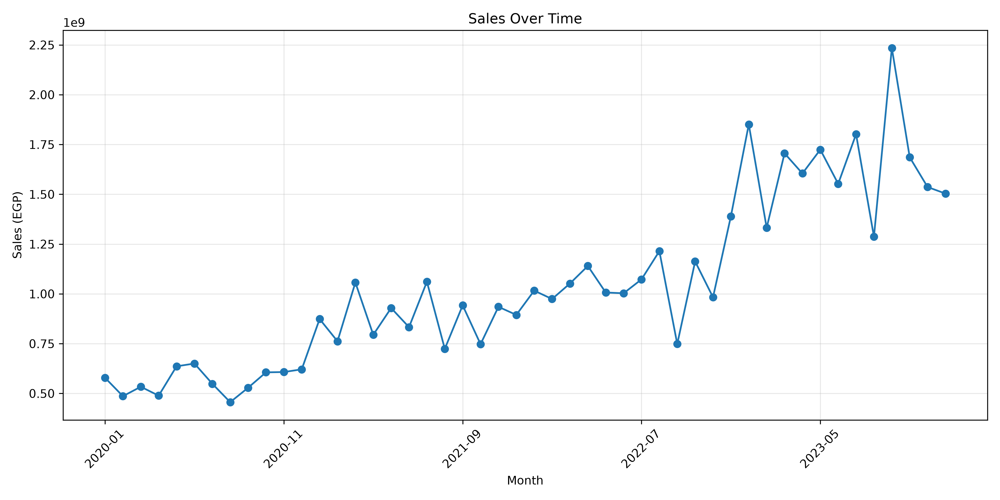
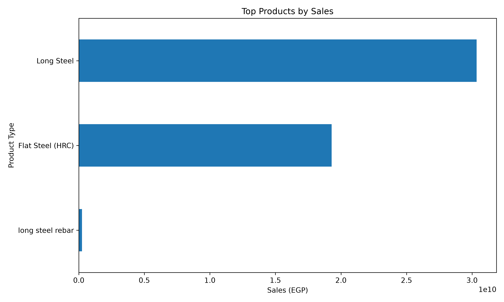
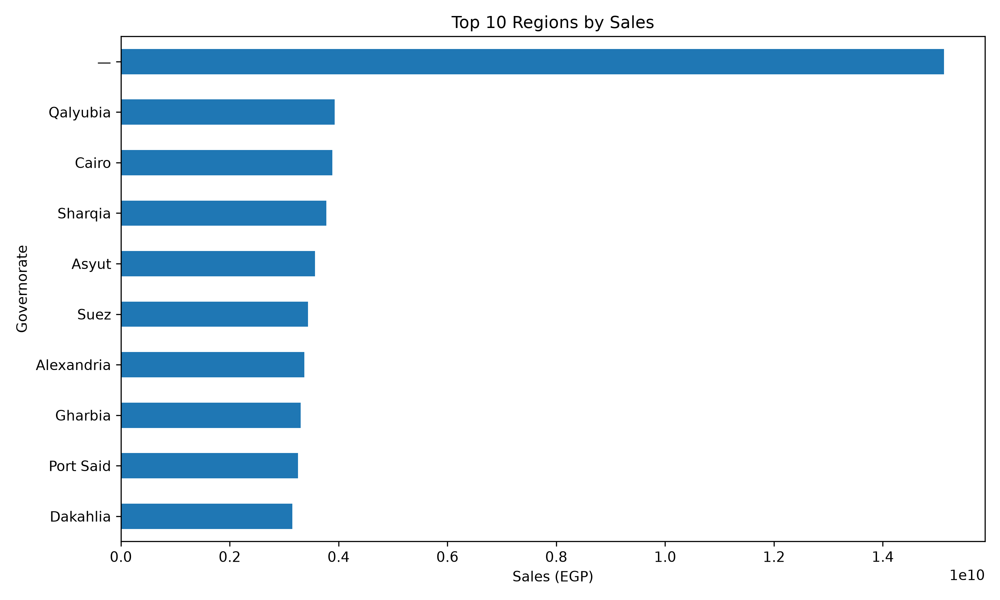

# Task 01 — Basic Sales Data Analysis

Part of the **VOLTIX Internship Program — Data Analysis Track**.

## Objective

Perform basic sales data analysis through:

* Data cleaning
* Sales analysis
* Data visualization
* Business insights

## Dataset

The dataset used for this task was provided by **VOLTIX** as part of the internship activities.

**Dataset:** `EzzSteel_Full_Dataset.xlsx`

## Technologies

* Python
* Pandas
* Matplotlib
* Excel

## Analysis

The analysis covers:

1. Total Sales
2. Total Profit
3. Best Product by Sales
4. Best Region by Sales
5. Month with Highest Sales

> **Note:** Profit could not be calculated accurately because the dataset does not contain a Profit column or sufficient cost information.

## Visualizations

### Sales by Product Type

### Sales Over Time

### Top Products

### Sales by Region

## Key Skills Demonstrated

* Data Cleaning
* Data Type Handling
* Duplicate Detection
* Exploratory Data Analysis
* Data Aggregation
* Data Visualization
* Business Insights
* Python / Pandas
* Excel
* Git & GitHub

