# 📊 Task 3 — HR Employee Attrition Analysis

## 📌 Project Overview

This project was developed as part of the **VOLTIX Internship Program — Data Analysis Track**.

The objective of this task is to analyze employee data to understand workforce distribution, salaries, experience, performance, employee satisfaction, and the factors associated with employee attrition.

The analysis includes data cleaning, exploratory data analysis, statistical summaries, data visualizations, and an interactive dashboard developed with **Microsoft Power BI**.

---

## 🎯 Objectives

The main objectives of this analysis are:

* Clean and prepare the employee dataset.
* Analyze employees by department and job role.
* Analyze salaries, work experience, and performance.
* Analyze employee job satisfaction and work-life balance.
* Analyze employee attrition.
* Identify relationships between attrition and factors such as overtime, job satisfaction, and work-life balance.
* Create visualizations to communicate the main findings.
* Develop an interactive Power BI dashboard containing the most important KPIs and insights.

---

## 📂 Dataset

The dataset contains information about **1,470 employees** and initially includes **35 columns** describing different aspects of the workforce.

The dataset includes variables related to:

* Employee demographics
* Department and job role
* Monthly income
* Total working years
* Job satisfaction
* Performance rating
* Overtime
* Work-life balance
* Years at company
* Employee attrition

### Data Cleaning

The dataset was reviewed for:

* Duplicate records
* Missing values
* Data types
* Constant columns
* Numeric and categorical values

No duplicate records or missing values were found.

The following constant columns were removed because they do not provide analytical information:

* `EmployeeCount`
* `Over18`
* `StandardHours`

After cleaning, the dataset contains **1,470 records and 32 columns**.

---

## 📊 Key Performance Indicators

| KPI                         |    Value |
| --------------------------- | -------: |
| Total Employees             |    1,470 |
| Employees with Attrition    |      237 |
| Attrition Rate              |   16.12% |
| Average Monthly Income      | 6,502.93 |
| Average Total Working Years |    11.28 |

---

# 🔎 Main Analysis

## 🏢 Employees by Department

The workforce is distributed across three departments:

* **Research & Development:** 961 employees
* **Sales:** 446 employees
* **Human Resources:** 63 employees

### Visualization

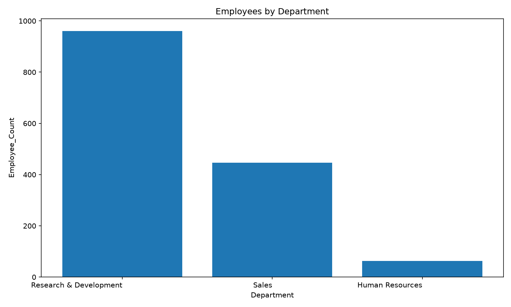

---

## 👔 Employees by Job Role

The largest job roles are:

* **Sales Executive:** 326
* **Research Scientist:** 292
* **Laboratory Technician:** 259
* **Manufacturing Director:** 145
* **Healthcare Representative:** 131

### Visualization

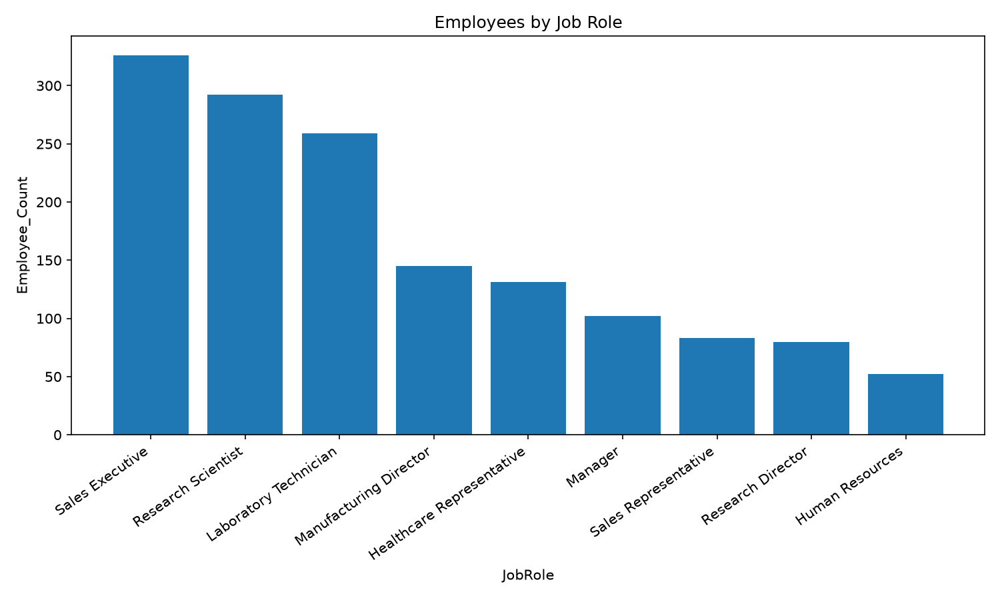

---

# 💰 Salary Analysis

The department with the highest average monthly income is **Sales**, with an average of approximately **6,959.17**.

By job role, the highest average monthly incomes are:

| Job Role                  | Average Monthly Income |
| ------------------------- | ---------------------: |
| Manager                   |              17,181.68 |
| Research Director         |              16,033.55 |
| Healthcare Representative |               7,528.76 |
| Manufacturing Director    |               7,295.14 |
| Sales Executive           |               6,924.28 |

The results show substantial differences in average income between job roles.

### Average Monthly Income by Department

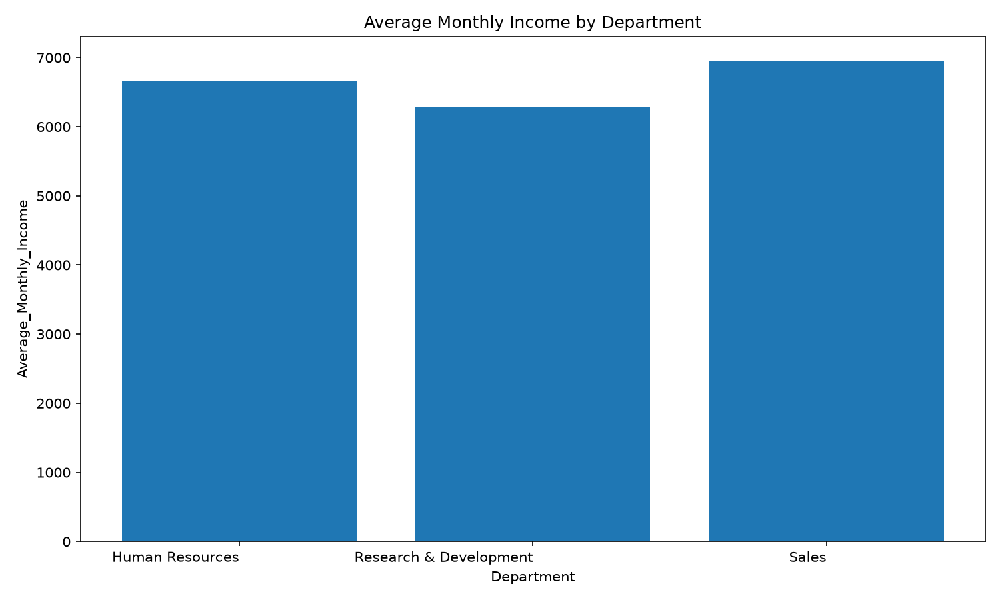

### Average Monthly Income by Job Role

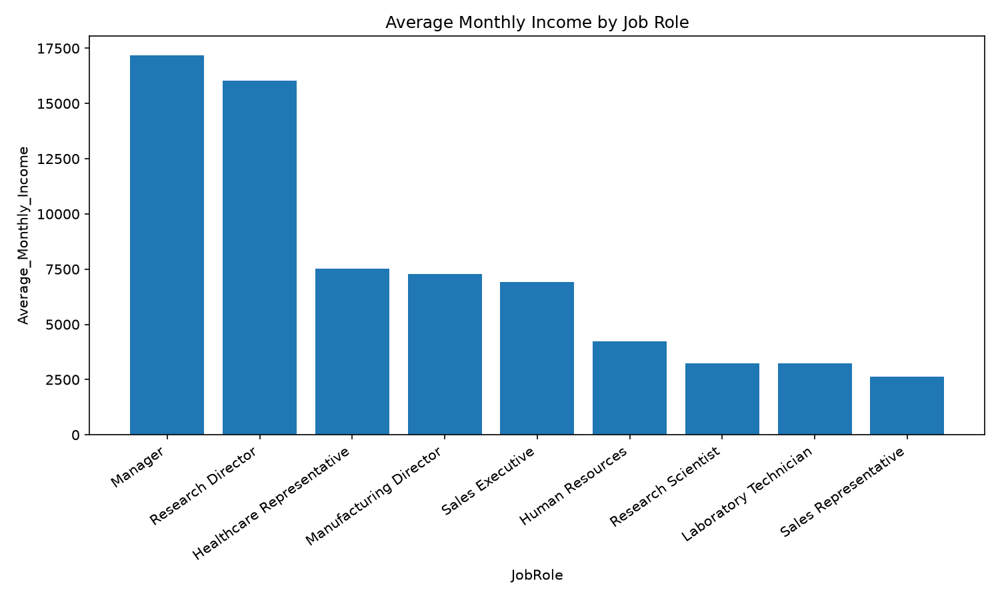

---

# 📈 Experience and Performance

The analysis includes the relationship between **Total Working Years** and **Monthly Income** to examine how compensation changes with professional experience.

### Monthly Income vs. Total Working Years

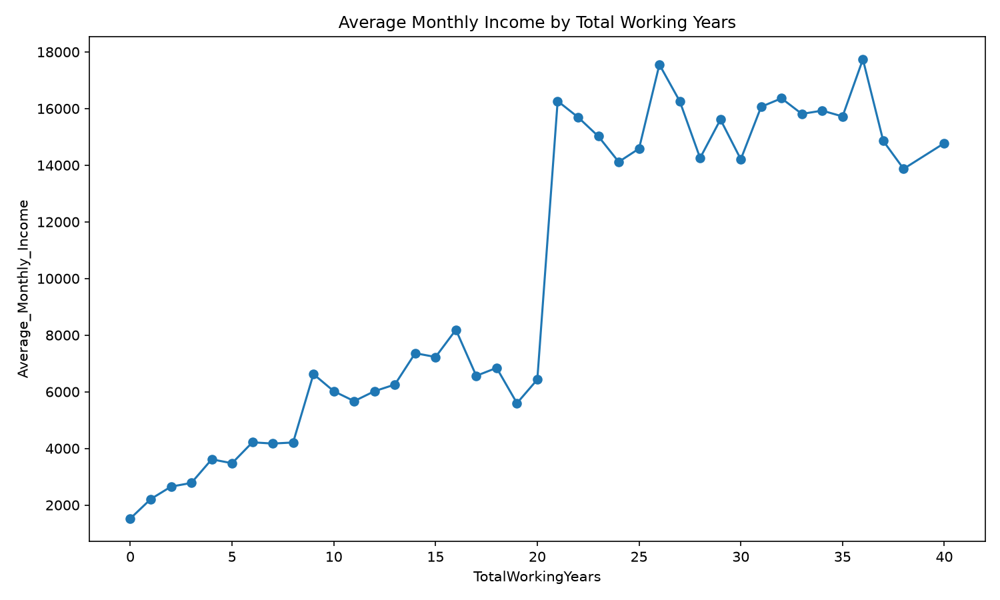

Performance ratings are distributed across two categories:

* **Rating 3:** 1,244 employees
* **Rating 4:** 226 employees

### Performance Rating

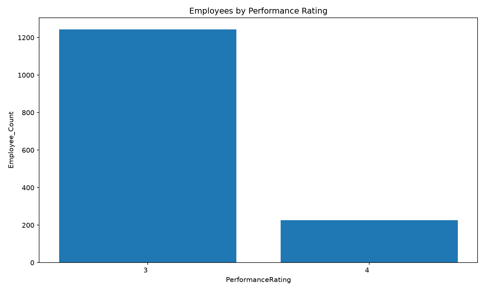

---

# 😊 Employee Satisfaction

## Job Satisfaction

Employee job satisfaction is distributed as follows:

| Satisfaction Level | Employees |
| ------------------ | --------: |
| 1                  |       289 |
| 2                  |       280 |
| 3                  |       442 |
| 4                  |       459 |

The highest number of employees have a job satisfaction level of **4**.

### Visualization

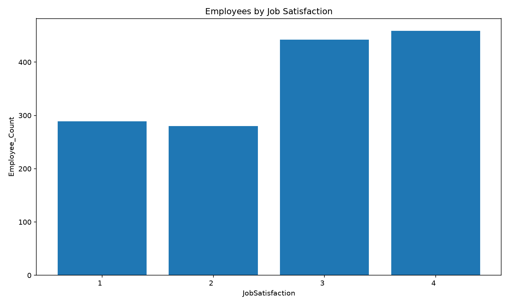

---

## ⚖️ Work-Life Balance

The distribution of work-life balance is:

| Level | Employees |
| ----- | --------: |
| 1     |        80 |
| 2     |       344 |
| 3     |       893 |
| 4     |       153 |

Level **3** represents the largest group of employees.

### Visualization

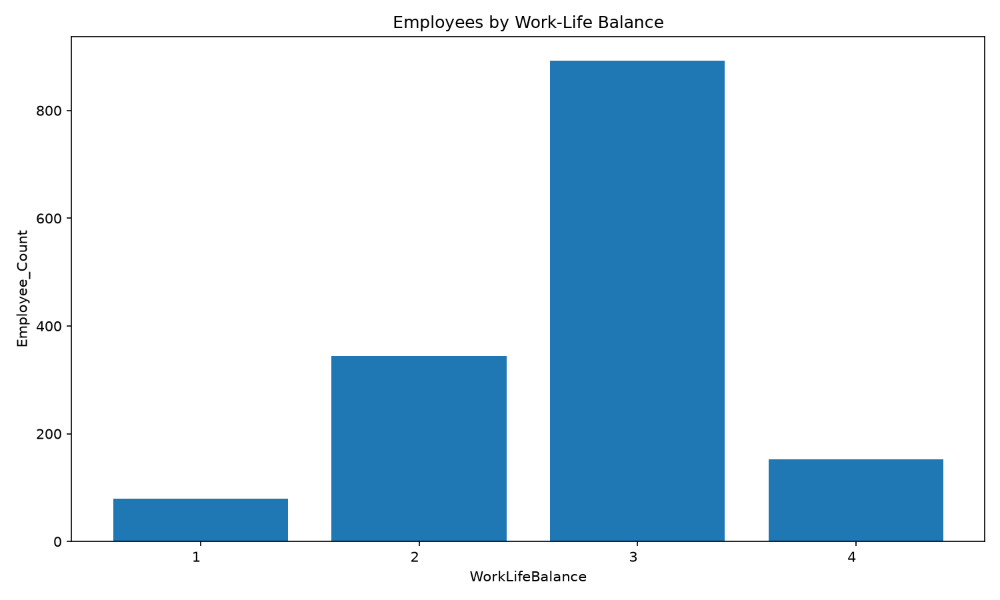

---

# ⚠️ Attrition Analysis

Overall, **237 employees** have an Attrition value of `Yes`, representing an attrition rate of **16.12%**.

### Overall Attrition

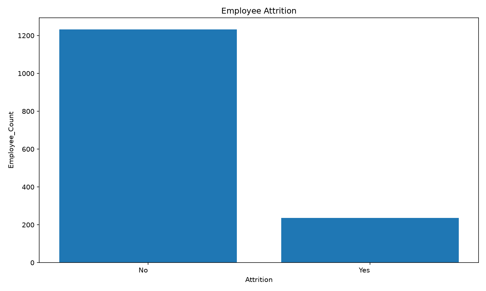

---

## ⏰ Attrition and Overtime

A strong difference can be observed between employees who work overtime and those who do not:

| Overtime | Attrition Rate |
| -------- | -------------: |
| No       |         10.44% |
| Yes      |         30.53% |

Employees working overtime show a substantially higher attrition rate.

### Visualization

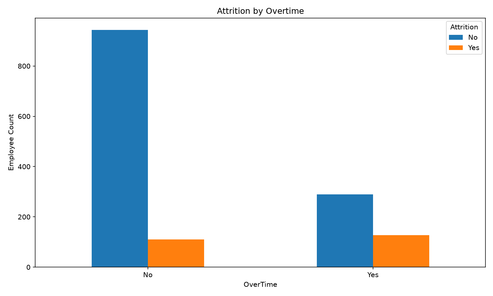

---

## 😊 Attrition and Job Satisfaction

| Job Satisfaction | Attrition Rate |
| ---------------- | -------------: |
| 1                |         22.84% |
| 2                |         16.43% |
| 3                |         16.52% |
| 4                |         11.33% |

The lowest job satisfaction level is associated with a higher attrition rate compared with the highest satisfaction level.

### Visualization

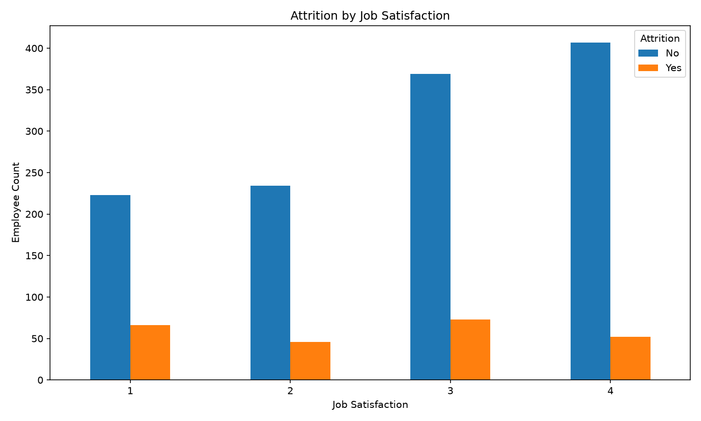

---

## ⚖️ Attrition and Work-Life Balance

| Work-Life Balance | Attrition Rate |
| ----------------- | -------------: |
| 1                 |         31.25% |
| 2                 |         16.86% |
| 3                 |         14.22% |
| 4                 |         17.65% |

Employees with a work-life balance level of **1** show the highest attrition rate.

### Visualization

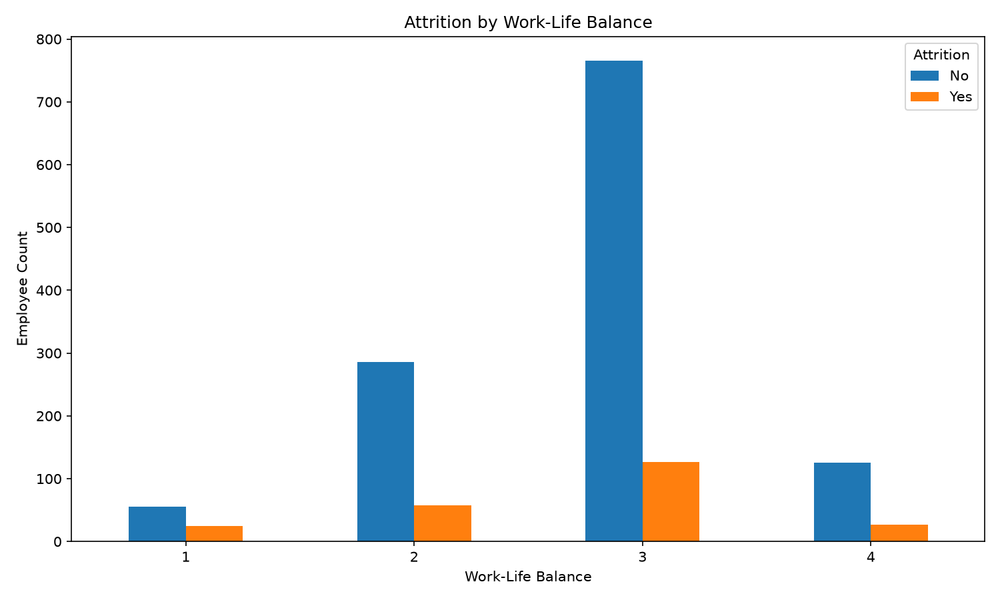

---

# 🏢 Attrition by Department

The highest attrition rate is observed in the **Sales** department.

| Department             | Attrition Rate |
| ---------------------- | -------------: |
| Sales                  |         20.63% |
| Human Resources        |         19.05% |
| Research & Development |         13.84% |

### Visualization

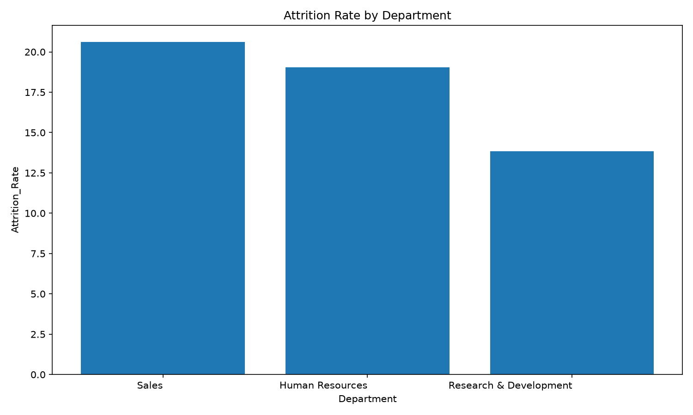

---

# 👔 Attrition by Job Role

The job roles with the highest attrition rates are:

| Job Role              | Attrition Rate |
| --------------------- | -------------: |
| Sales Representative  |         39.76% |
| Laboratory Technician |         23.94% |
| Human Resources       |         23.08% |
| Sales Executive       |         17.48% |
| Research Scientist    |         16.10% |

**Sales Representative** has the highest attrition rate among the analyzed job roles.

### Visualization

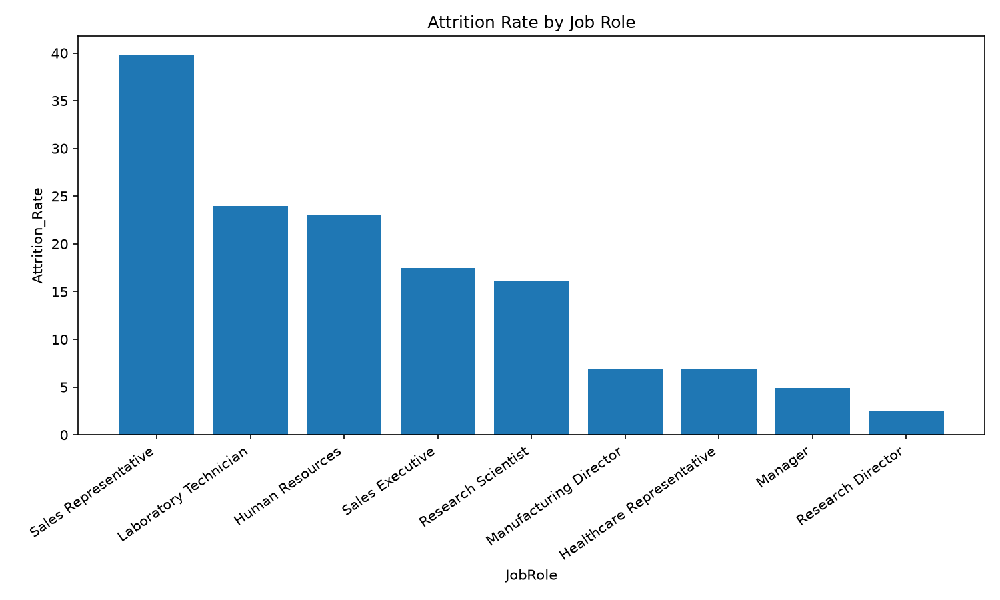

---

# 📊 Visualizations

The project includes the following visualizations:

### Workforce Distribution


### Salary Analysis


### Performance and Satisfaction


### Attrition Analysis


All generated charts are stored in the `Charts` folder.

---

# 📊 Interactive Power BI Dashboard

An interactive dashboard was developed using **Microsoft Power BI**.

The dashboard presents the main KPIs and findings from the analysis, including:

* Total Employees
* Attrition Count
* Attrition Rate
* Average Monthly Income
* Average Experience
* Employees by Department
* Employees by Job Role
* Salary Analysis
* Job Satisfaction
* Work-Life Balance
* Attrition by Overtime
* Attrition by Department
* Attrition by Job Role

Interactive filters allow the data to be explored from different perspectives.

The Power BI source file is included in the project:

```text
HR_Employee_Attrition_Dashboard.pbix
```

---

# 📁 Project Structure

```text
Task-03-HR-Employee-Attrition-Analysis/
│
├── Dataset/
│   ├── WA_Fn-UseC_-HR-Employee-Attrition.csv
│   └── HR_Employee_Attrition_Cleaned.csv
│
├── Charts/
│   ├── employees_by_department.png
│   ├── employees_by_job_role.png
│   ├── salary_by_department.png
│   ├── salary_by_job_role.png
│   ├── salary_vs_experience.png
│   ├── performance_rating.png
│   ├── job_satisfaction.png
│   ├── work_life_balance.png
│   ├── attrition_overview.png
│   ├── attrition_by_overtime.png
│   ├── attrition_by_job_satisfaction.png
│   ├── attrition_by_work_life_balance.png
│   ├── attrition_by_department.png
│   └── attrition_by_job_role.png
│
├── HR_Employee_Analysis.py
├── HR_Employee_Attrition_Dashboard.pbix
├── Insights.docx
└── README.md
```

---

# 🛠️ Technologies Used

* **Python**
* **Pandas**
* **Matplotlib**
* **Microsoft Power BI**
* **CSV**
* **Git & GitHub**

---

# ▶️ How to Run the Analysis

Make sure the dataset is located inside the `Dataset` folder.

Run the following command from the project directory:

```bash
python HR_Employee_Analysis.py
```

The script automatically:

1. Loads the dataset.
2. Cleans and prepares the data.
3. Calculates the main KPIs and analysis tables.
4. Generates the visualizations.
5. Exports the cleaned dataset.

---

# 💡 Key Insights

The analysis highlights several important patterns:

1. The overall employee attrition rate is **16.12%**.
2. Employees working overtime have a substantially higher attrition rate (**30.53%**) than employees who do not (**10.44%**).
3. Employees with the lowest job satisfaction level show a higher attrition rate than those with the highest satisfaction level.
4. Employees with the lowest work-life balance level have the highest attrition rate (**31.25%**).
5. The **Sales** department has the highest departmental attrition rate (**20.63%**).
6. **Sales Representatives** have the highest attrition rate among job roles (**39.76%**).
7. Average monthly income varies considerably across job roles, with **Managers** having the highest average income.

These findings can help identify areas that may require further investigation regarding employee retention, workload, satisfaction, and workforce management.

---

# 📌 Internship

**Program:** VOLTIX Internship Program
**Track:** Data Analysis
**Task:** Task 3 — HR Employee Attrition Analysis


