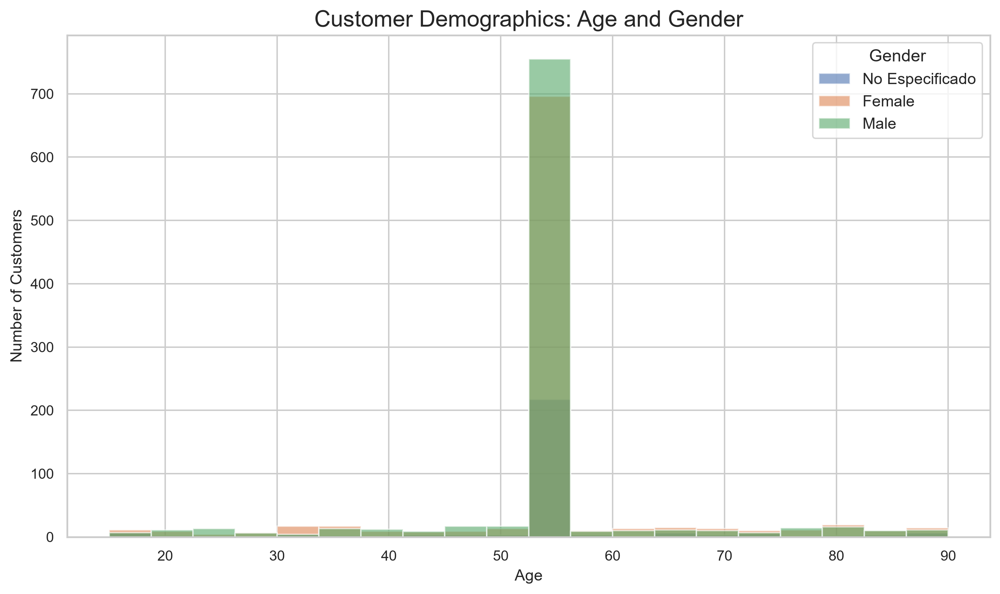
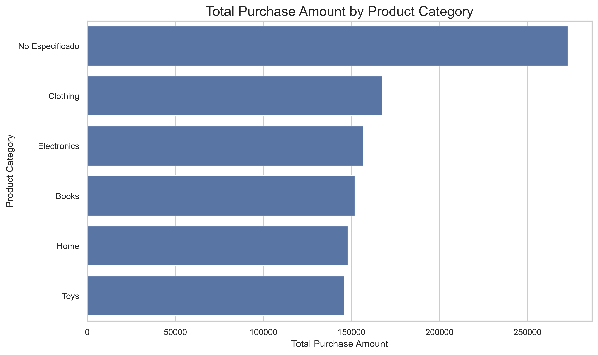
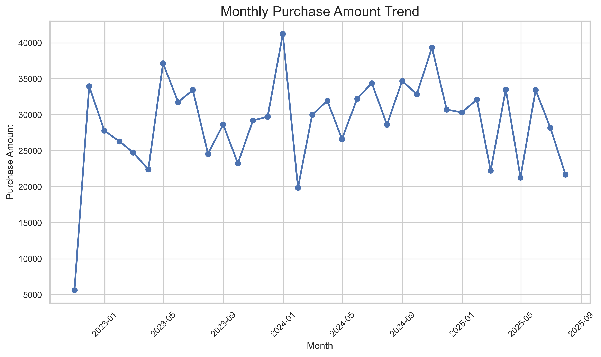
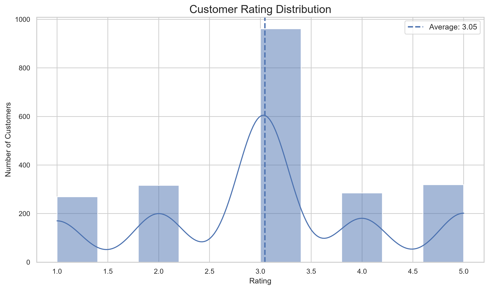

# Customer Data Analysis — VOLTIX Internship Task 9

## Overview

This project performs a complete analysis of customer data, including data cleaning, customer demographics, purchases, product categories, customer ratings, purchase trends, visualizations, and an interactive Power BI dashboard.

The analysis was developed as part of the **VOLTIX Internship — Data Analysis Track, Task 9**.

## Dataset

The original dataset contains **2,150 records** and customer information related to demographics, purchases, product categories, ratings, gender, and purchase dates.

The cleaned dataset was prepared to improve data quality and consistency before analysis.

## Data Cleaning

The cleaning process includes:

- Removing the technical `Unnamed` column.
- Consolidating duplicate Gender columns.
- Standardizing Gender values.
- Detecting and correcting invalid Age values.
- Handling invalid Rating values.
- Converting PurchaseDate to a date format.
- Converting PurchaseAmount to numeric format.
- Handling missing ProductCategory values as `No Especificado`.
- Preserving missing PurchaseAmount and PurchaseDate values where appropriate for analysis.

### Cleaned Dataset

- **Rows:** 2,150
- **Columns:** 10
- **Unique Customers:** 2,100
- **Valid Purchase Records:** 2,049

## Key Performance Indicators

| KPI | Result |
|---|---:|
| Total Revenue | $1,043,799.29 |
| Average Purchase Amount | $509.42 |
| Total Customers | 2,100 |
| Average Customer Rating | 3.05 / 5 |
| Highest Purchase | $999.56 |
| Lowest Purchase | $5.06 |

## Key Findings

### Purchases and Categories

The total purchase amount from valid purchase records is **$1,043,799.29**, with an average purchase amount of **$509.42**.

Among the specified product categories, **Clothing** generated the highest total purchase amount with **$167,661.02**.

The `No Especificado` category represents missing product-category information and is therefore not treated as a real product category.

### Purchase Trends

The analysis covers purchases from **October 27, 2022 to July 23, 2025**.

The highest monthly purchase amount occurred in **December 2023**, with approximately **$41,242.13**.

### Customer Demographics

The cleaned customer data has an age range from **15 to 90 years**, with an average age of approximately **54.46 years**.

Gender distribution:

- Male: 962
- Female: 915
- No Especificado: 273

### Customer Ratings

The average customer rating is approximately **3.05 out of 5**.

## Visualizations

### Customer Demographics



### Sales by Product Category



### Monthly Purchase Trend



### Customer Rating Distribution



## Power BI Dashboard

The project includes an interactive Power BI dashboard containing:

- Total Revenue
- Average Purchase Amount
- Total Customers
- Average Customer Rating
- Monthly Purchase Amount Trend
- Customers by Gender
- Total Purchase Amount by Product Category
- Purchase Date filter
- Product Category filter
- Gender filter

Dashboard file:

`Customer_Analysis.pbix`

## Project Structure

```text
Task-09-Customer-Data-Analysis/
│
├── Customers_Fakedata.csv
├── Customers_Fakedata_Cleaned.csv
│
├── Customer_Data_Cleaning.py
├── Customer_Data_Visualization.py
├── Customer_Analysis.py
│
├── Customer_Analysis.pbix
│
├── Insights.docx
├── README.md
│
└── charts/
    ├── customer_demographics.png
    ├── sales_by_category.png
    ├── purchase_trend.png
    └── rating_distribution.png
```

## Tools Used

- Python
- Pandas
- Matplotlib
- Seaborn
- Power BI
- Microsoft Word
- GitHub

## Deliverables

This project includes:

- Cleaned and structured customer dataset.
- Python data-cleaning script.
- Python visualization script.
- Python analysis script.
- Four analytical visualizations.
- Interactive Power BI dashboard.
- Executive summary with key findings.
- Project documentation.
